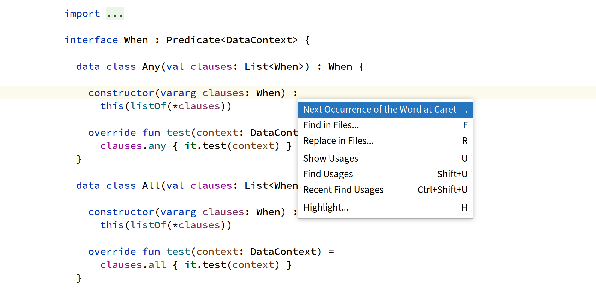

# Actions Tree

This plugin allows you to define a list of actions to show in a popup,
an action in the list can be a further action list to show when
invoked, or an ordinary IDE action. Each action in the list can be
assigned a keyboard shortcut that is local to the list, doesn't
conflict with other global shortcuts. This allows simulation of Emacs
like prefix keys (n-level deep), so you are not restricted to IntelliJ
keymap's maximum of two key strokes.



## Configuration

Configuration is done via a JSON file, set it under *Preferences |
Keymap | Actions Tree*.

The following is an example Emacs like configuration:

```json
{
  "items": [
    { "keys": ["ctrl alt BACK_SLASH"], "id": "ReformatCode" },
    {
      "keys": ["ctrl alt BACK_SLASH"],
      "id": "Haskell.ReformatCode",
      "when": "FileExtension:hs"
    },
    {
      "keys": ["ctrl alt BACK_SLASH"],
      "id": "Cargo.RustfmtFile",
      "when": "FileExtension:rs"
    },
    {
      "keys": ["EQUALS"],
      "id": "CompareTwoFiles",
      "when": { "all": ["ToolWindowActive:.*", "!InputFocused"] }
    },
    {
      "keys": ["ctrl X"],
      "items": [
        { "keys": ["ctrl F"], "id": "GotoFile" },
        { "keys": ["ctrl B", "B"], "id": "RecentFiles" },
        { "keys": ["K", "0"], "id": "CloseContent", "separator-above": "" },
        { "keys": ["1"], "id": "UnsplitAll" },
        { "keys": ["2"], "id": "SplitHorizontally" },
        { "keys": ["3"], "id": "SplitVertically" },
        { "keys": ["O"], "id": "NextSplitter" },
        { "keys": ["H"], "id": "$SelectAll", "separator-above": "" },
        { "keys": ["ctrl C"], "id": "Exit", "separator-above": "" }
      ]
    },
    {
      "keys": ["alt S"],
      "items": [
        { "keys": ["typed ."], "id": "Find" },
        { "keys": ["alt typed %"], "id": "Replace" },
        {
          "keys": ["H"],
          "separator-above": "",
          "name": "Highlight...",
          "items": [
            { "keys": ["typed ."], "id": "HighlightUsagesInFile" },
            {
              "keys": ["N"],
              "id": "GotoNextElementUnderCaretUsage",
              "sticky": true
            },
            {
              "keys": ["P"],
              "id": "GotoPrevElementUnderCaretUsage",
              "sticky": true
            }
          ]
        }
      ]
    }
  ]
}
```

With the above example configuration, typing `ctrl X` will show a
popup containing its items, then typing `H` will invoke the
`$SelectAll` action.

The basic structures are:

1. Action Group - defines a custom group of actions:

    ```json
    {
      "id": "...",
      "keys": [...],
      "name": "...",
      "when": "...",
      "separator-above": "...",
      "items": [...]
    }
    ```

    - `id`: (optional) specify your own ID for this action group if
      you want to reference it somewhere, such as from your IdeaVim
      config via the `:action` command.
      
    - `keys`: (optional) typing any of these key strokes while the
       parent popup is showing will invoke this action, for the format
       see [JDK's KeyStroke class](https://docs.oracle.com/javase/8/docs/api/javax/swing/KeyStroke.html#getKeyStroke-java.lang.String-).
       
       Basic format is `modifiers <KEY>`.
       
       Where modifiers can be one or more of:
         - `shift`
         - `control`
         - `ctrl`
         - `meta`
         - `alt`
         - `altGraph`.
        
        And `<KEY>` can be one of:

         - Any upper case constants prefixed with `VK_` in the
           [KeyEvent](https://docs.oracle.com/javase/8/docs/api/java/awt/event/KeyEvent.html#field.summary)
           class. But you need to specify the name of the constant
           without the `VK_` prefix.

         - `typed <CHAR>` where `<CHAR>` is the unicode character to
           be typed, case sensitive.

    - `name`: (optional) name to display in the popup.

    - `when`: (optional) only execute this action under this
       condition. Its value can be:

        - `FileExtension:<regex>`: file extension matches `<regex>`,
          e.g. `FileExtension:java`.

        - `ToolWindowActived:<regex>`: active tool window name matches
          `<regex>`, e.g. `ToolWindowActive:Project`.

        - `ToolWindowTabActived:<regex>`: active tool window's active
          tab title matches `<regex>`, e.g. `ToolWindowTabActive:Log`.

        - `InputFocused`: an input editor or field is in focus.
        
        - `!<expression>`: `!` negates a condition,
          e.g. `!InputFocused`.

        - `{ "all": [...] }`: evaluates to true when all values are
          true. Each value in the array must be one of the values in
          this list.

        - `{ "any": [...] }`: evaluates to true when at least one of
          the values is true. Each value in the array must be one of
          the values in this list.
          
       When different actions are registered to the same key strokes
       with different `when` values, the last whose `when` evaluates
       to true at invocation time will be executed.

    - `separator-above`: (optional) inserts this string separator
      above this item in the popup, empty for a line separator

    - `items`: (required) sub-actions to show in a popup when this
      action is invoked, each item can be an action group or an action
      reference.

2. Action Reference - references an existing IDE action:

    ```json
    {
      "keys": [...],
      "when": ...,
      "separator-above": "...",
      "sticky": ...,
      "id": "..."
    }
    ```

    - `keys`: same as above

    - `when`: same as above

    - `separator-above`: same as above

    - `stick`: if an action is sticky, invoking it will not dismiss
      the popup, allowing you to repeat the action again or invoke
      other actions on the popup.

    - `id`: (required) the ID of an existing action to invoke. To find
      the ID of an action, use *Tools | Actions Tree | Export IDE
      Actions* to export the ID to name mappings of all your IDE
      actions.

The top level actions will be registered as global actions in the
keymap (can be seen under *Preferences | Keymap | Plug-ins | Actions
Tree*) so they can be invoked anywhere, so be sure to check your
keymap to make sure their keys don't conflict with other actions.

Any change to the configuration file can be reloaded via *Tools |
Actions Tree | Reload*.


## Building

JDK 8 is required for runtime.

JDK 13 is required to build and run the tests of this project.

To build the plugin, run `./gradlew clean build`, then
build/distributions/actions-tree-xxx.zip will be created. It can be
installed by going to the IntelliJ's plugins settings, and choose
install from disk.

